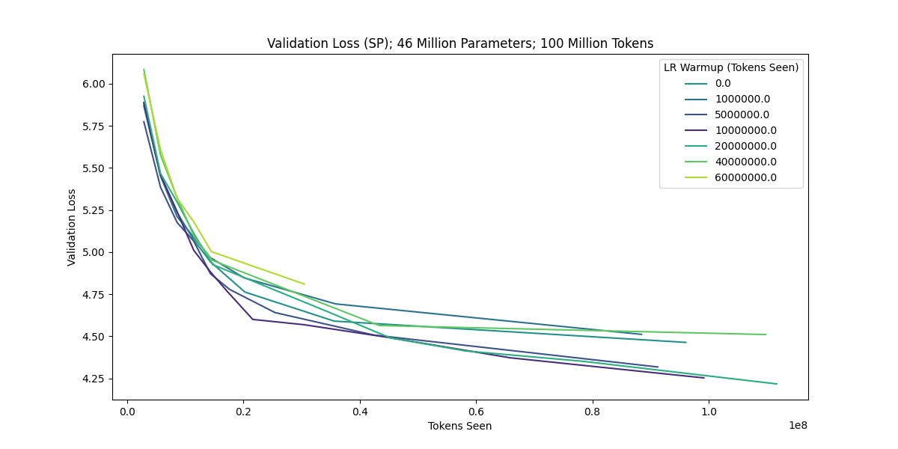
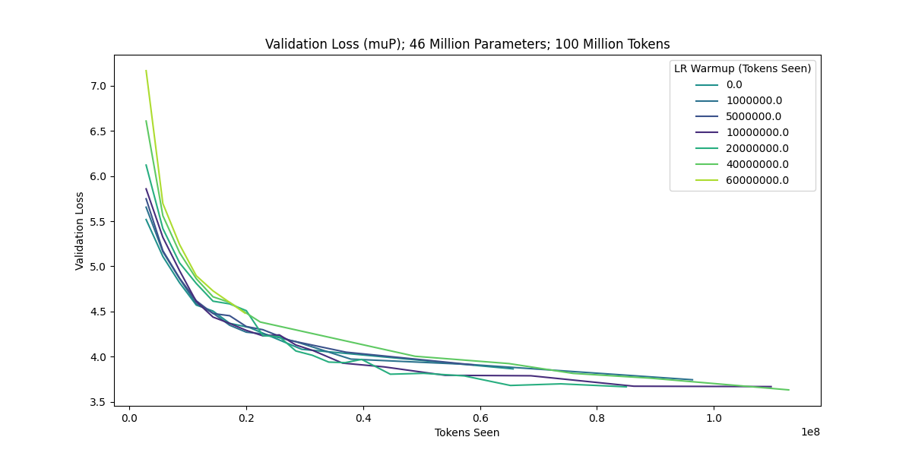
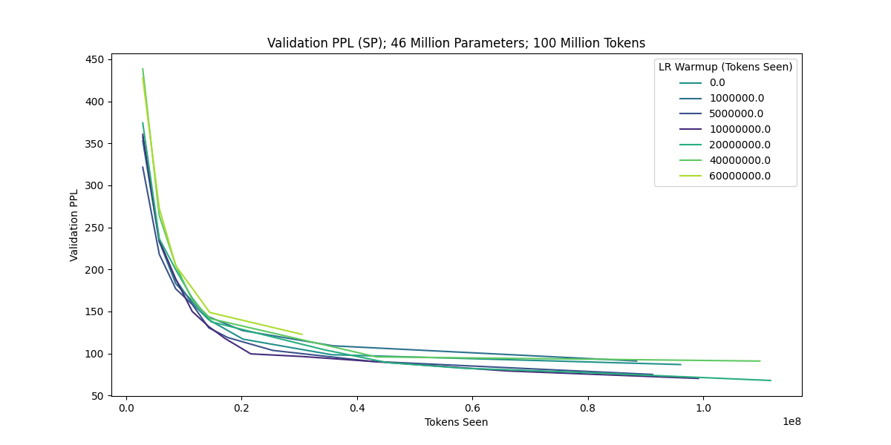
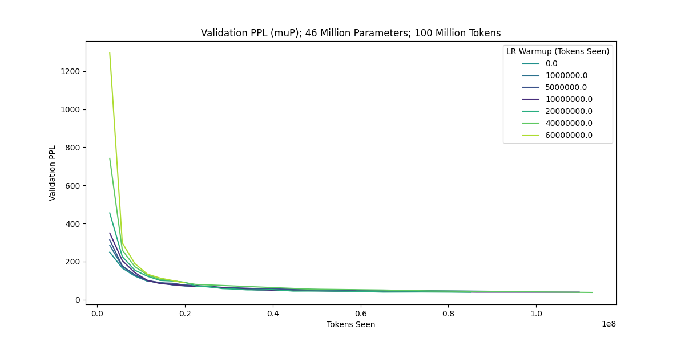
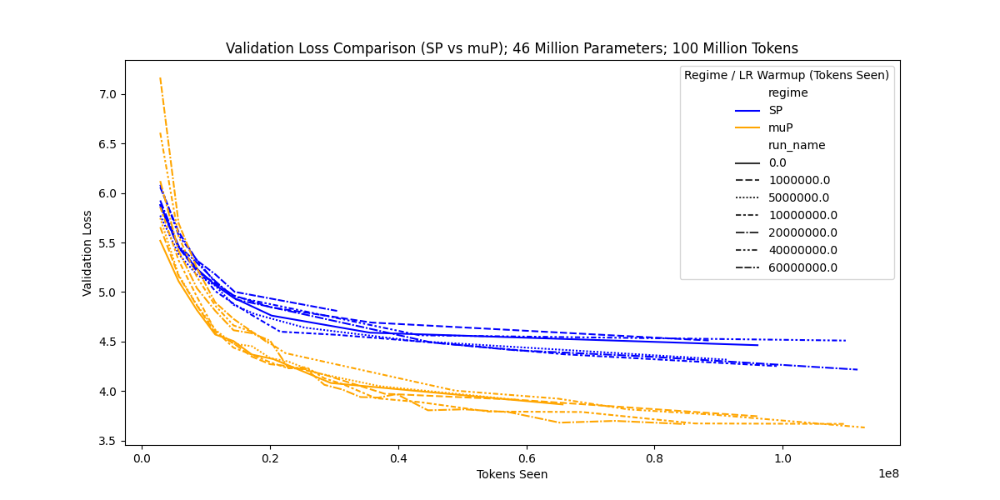

4 We investigate the impact of learning rate warmup on GPT-style Transformers using muP/SP
5 trained on a realistic repository on language modeling. We train on wikitext-2 for a single epoch
6 and report the validation loss.
7 In the extension phase, we wanted to answer the following questions: 1) Does muP lead to perfor-
8 mance gains in practical settings? 2) Do we still need learning rate warmup under muP?
9 We are in the realistic setting since we are using hlb-gpt (Hyperlightspeedbench-gpt [1]), which
10 incorporates numerous techniques that are used in the large-scale setting by all major research
11 labs in industry. These include fused attention+MLP blocks, a dynamic microbatch scheduler
12 based on the expected gradient norm, parameter-group dependent learning rates and schedules,
13 an empirically motivated scaling of the learning rate with model size as well as sequence length
14 warmup with maximum batch size calculations based on the available VRAM.
15 Since latter technique leads to ‘unaligned’ loss curves, we modify the repository such that learning
16 rate schedule and warmup are based on tokens seen instead of the actual step count. That
17 way we ensure that loss curves across runs are aligned. For the muP experiments, we remove
18 the parameter-group dependent learning rates and schedules as well as the empirically motivated
19 learning rate scaling factors from the repository, since these are techniques that muP natively
20 implements.
21 [1] https://github.com/tysam-code/hlb-gpt/
22 Our experiments yield the following validation loss and perplexity curves:

27 Here, the color difference between a curve and the best curve depicts the distance from the best
28 run in terms of learning rate warmup. The plots depict a clear color gradient, i.e. the farther a
29 run departs from the optimal learning warmup, the worse the convergence. Thus, learning rate
30 warmup is still helpful, even under muP. However, the curves under muP are closer together than
31 under SP, suggesting that learning rate warmup is more impactful under SP than under muP,
32 answering our second question for the extension phase and confirming a hypothesis of the research
33 community [2].
34 [2] https://cloneofsimo.notion.site/What-to-do-to-scale-up-09e469d7c3444d6a90305397c38a46f5
35 Lastly, we plot the validation loss curves of muP and SP in the same plot:

37 Here, we see that muP consistently outperforms SP in our experiments, affirmatively answering
38 our first question of the extension phase. Not only that, but muP outperforms SP in a repository
39 that implements empirical scaling laws based learning rates as well as parameter group dependent
40 initialization, learning rates and schedules.

---

 

## hlb-GPT

Welcome to the hyperlightspeedbench-gpt (hlb-gpt) repository! This project is meant to be the best tool for researchers wanting to quickly explore new LLM ideas. It is also intended to be a good starting point for new projects and new ML developers. The code is simple, performant and well-documented with good default hyperparameters. It also optionally scales from 46 M parameters (the default) to up to 3 B parameters on a single A100 just by changing the model_scale parameter -- the rest of the hyperparameters are automatically inferred (though the scaling feature is still in alpha as the large model hyperparameters still need tuning).

### How to Run

`git clone https://github.com/tysam-code/hlb-gpt && cd hlb-gpt && python -m pip install -r requirements.txt && python main.py`

This code was developed exclusively in Colab, but also runs in the terminal as well. If you are running it in Colab, be sure to uncomment the code block at the top.

### Main

This code achieves a ~3.80 validation loss on WikiText-103 within about 100 seconds or so on a single A100 with default settings. By default, it runs for 1000 steps before ending and running a demo inference on the trained network, though you can (and should!) change this value as you begin experimenting. The learning rate schedulers are set to run infinitely, the step count is just a cutoff. As one of the design decisions to keep things simple, this code does assume that you are using a 40 GB A100, though hopefully we will be able to port to more GPU memory sizes as the scaling rules solidify.

The code is very short -- just over 300 lines or so. It implements a number of novel (or at least, novel-to-the-author) concepts, including a LatentAttention block that efficiently fuses attention and the MLP blocks into one, learnable linear position embeddings to let the attention layers learn a dynamic attention length, a dynamic microbatch scheduler based upon the expected gradient norm, a specific set of parameter group schedules, and several other things of various potential novelty.

I originally referenced nanoGPT when originally writing this code, though this code has certainly become its own beast at this point! Much appreciation to Karpathy and contributors for that codebase.

One of the intents of this codebase is to minimize the time-to-result for a given experiment. My experience leads me to believe that this is a good thing to optimize for (my appreciation to Keller Jordan for conversations on this topic a little while back).

If you have any questions, please let me know. My Twitter DMs should be open, as well as my email.

### Contact

Much of this work is supported by a combination of being both self-funded and being funded from the support of people like you. My Patreon is at [Patreon](https://www.patreon.com/user/posts?u=83632131) if you like what I'm doing here and would like to see more work like this in the future. If you want me to work up to a part-time amount of hours with you via consulting or contract work, please feel free to reach out to me at hire.tysam@gmail.com. I'd love to hear from you.

### Citation

If you use this work in your research, please cite
`@software{hlb-gpt_2024,
   author={Fern},
   month={3},
   title={{hlb-gpt}},
   url={https://github.com/tysam-code/hlb-gpt},
   version = {0.4.0},
   year = {2024}}`
